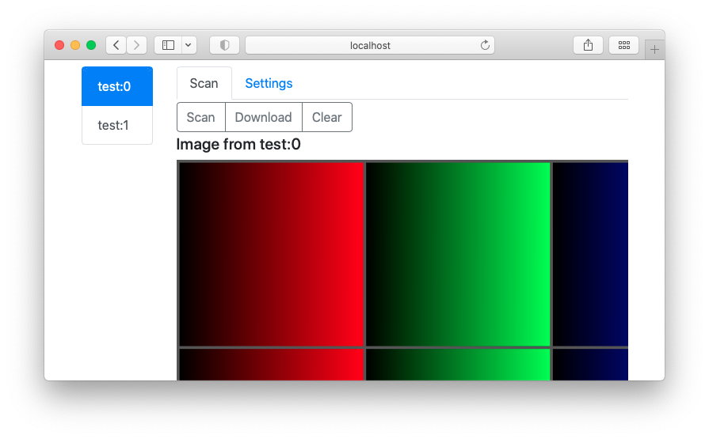

# scan

Scan is the frontend for SANE built with golang and svelte.



Features:

- List connected scanners.
- Configure the selected scanner.
- Scan image from the selected scanner.

## Build & run

Install libsane-dev, e.g. for Ubuntu:

```shell
sudo apt install -y libsane-dev
```

Build and run service:

```bash
go build -o scan ./cmd/scan
LISTEN=0.0.0.0:8085 ./scan
```

### Building with frontend

Build Svelte frontend with `node` and `npm`:

```bash
cd web
npm install
npm run build
```

Include fronend into the binary:

```bash
cd cmd/scan
go run github.com/gobuffalo/packr/packr
```

Now build the service:

```bash
go build -o scan ./cmd/scan
```

### Enabling test scanners

Open `dll.conf` file and uncomment `#test` line.

For Ubuntu/Debian:

```
/etc/sane.d/dll.conf
```

For Mac OS X:

```
/usr/local/etc/sane.d/dll.conf
```

## Environment variables

- `DEBUG` enables debug log level and text format for logs.
- `LISTEN` is the interface to listen for.