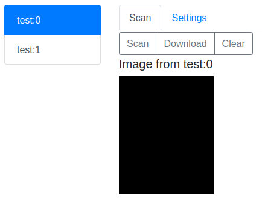

# scan

Scan is the frontend for SANE built with golang and svelte.



Features:

- List connected scanners.
- Scan image from the selected scanner.

## Build & run

```bash
go build -o scan ./cmd/scan
LISTEN=0.0.0.0:8085 ./scan
```